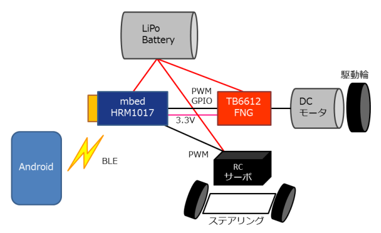
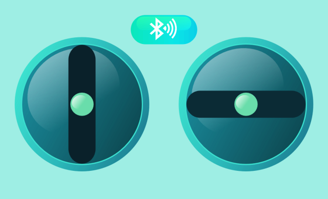
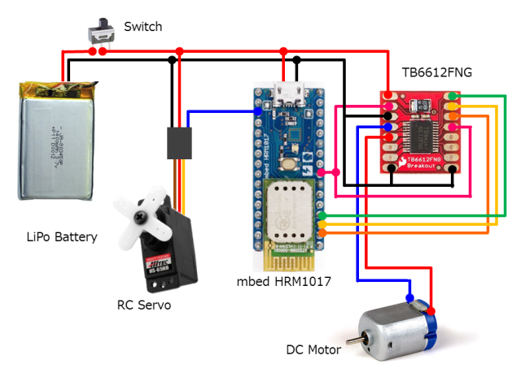

BLEPropo
=========

## 概要
BLEを使ったAndroid用ラジコンプロポアプリ、およびmbed HRM1017用ファームウェアです。

Androidアプリは、下図のようなUIです。

ラジコンは、mbed HRM1017とRCサーボやDCモータを組み合わせて作ります。
<!--
下図はミニ四駆を改造して作ったラジコンです。

-->

## 動作環境
### システム要件
* Android端末: Android 4.3 (API Level 18)以上で、BluetoothでBLEが使用可能な機種
* Bluetooth & マイコン: mbed HRM1017
* DCモータードライバ: Hブリッジで入力が PWM,IN1,IN2 の形式のもの

### 確認済み環境
* Android端末: Nexus7(2013), Android 4.4.2, xdpi 1920×1200 pixel
* Bluetooth & マイコン: mbed HRM1017
* DCモータードライバ: 東芝TB6612FNG

## ファイル一覧
* BLEPropo/: Android用プロポアプリのソース一式
* BLEPropoCtrl/: BLEPropoで使用するライブラリのソース一式
* MiniSteer_BLE/: ラジコン受信器となるマイコンのソース(※)
* LICENSE: Apache Licence 2.0です
* README.md これ

※ main.cppのみ。フルセットのソースはmbed.orgで公開(後述)

## 使い方

### Androidアプリのインストール
* BLEPropoCtrlとBLEPropoのプロジェクトフォルダをADTにインポートします。
* BLEPropoをADTからAndroid端末にインストールして実行します。

### mbed HRM1017のファームウェアのインストール
* ブラウザで[mbed.org](https://mbed.org/)にログインします。
* [MiniSteer2のリポジトリ](http://developer.mbed.org/users/lipoyang/code/MiniSteer2/)にアクセスします。
* 自分のコンパイラにプログラムをインポートします。
* コンパイルしてターゲットのボードに書き込みます。

### ハードウェア(例)

### アプリの操作
* Bluetoothロゴのボタンを押すと、接続するデバイスを選択する画面になります。
* ボタンの色は橙が未接続、青が接続済を示します。
* 見てのとおり、ラジコンプロポの要領で2本のスティックを操作します。

## 既知の問題
サーボがときどきぷるぷる痙攣します。BLEを動作させるとパルス幅が不安定になるようです。調査中。
